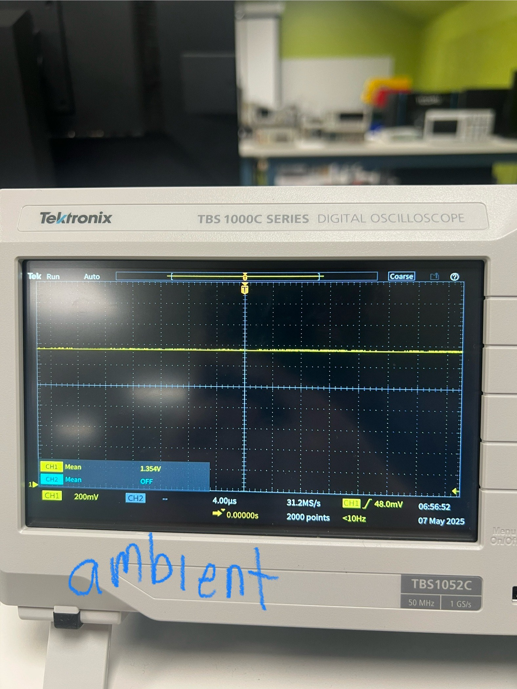
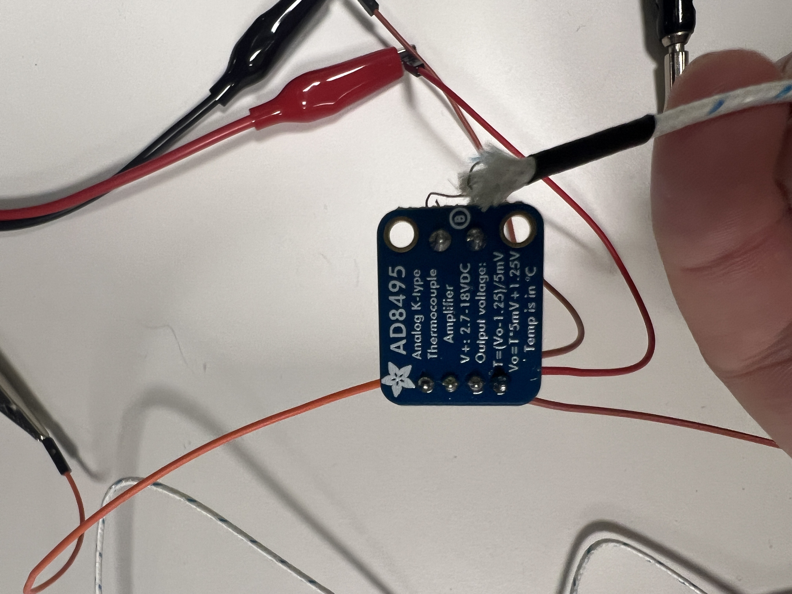

voltage_across: 
- AI0(+): short white
- AI0(-): short black

current: 
- AI1(+): long white
- AI1(-): long black

temperature: 
- AI2(+): nan
- AI2(-): nan

*note: these are differential pairs with ground reference existing at the ground for analog output, which is shorted to chassis. Not great, but works. Would be better to wire a ground with **each** differential pair.

# Cal

